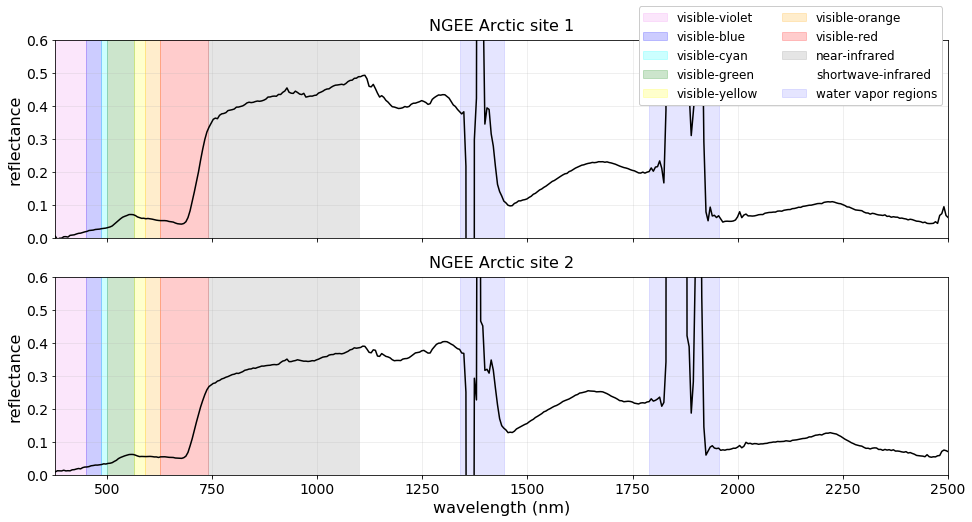

# Python: Basic processing of hyperspectral imagery from AVIRIS-NG collected during ABoVE airborne campaigns

*Date: February 19, 2019*  
*Contact for ORNL DAAC: uso@daac.ornl.gov*  

### Keywords: ABoVE, Airborne, Python

## Overview

The tutorial outlined in the [jupyter notebook](above-airborne-avirisng-python.ipynb) will outline a number of methods for manipulating hyperspectral imagery efficiently in Python.

Read more about the Arctic Boreal Vulnerability Experiment:                    
https://above.nasa.gov/       
https://daac.ornl.gov/cgi-bin/dataset_lister.pl?p=34               



*Figure. Spectral curve extracted for the center pixel of the reflectance granule using in the jupyter notebook.*

## Dataset

### ABoVE: Hyperspectral Imagery from AVIRIS-NG for Alaskan and Canadian Arctic, 2017    
[10.3334/ORNLDAAC/1569](https://doi.org/10.3334/ORNLDAAC/1569)  

**Abstract**     

This dataset provides Level 1 radiance and Level 2 surface reflectance measured by the Airborne Visible/Infrared Imaging Spectrometer-Next Generation (AVIRIS-NG) instrument during flights over the Arctic-Boreal Vulnerability Experiment (ABoVE) domain between June and August 2017. AVIRIS-NG measures reflected radiance at 5-nanometer (nm) intervals in the visible to shortwave infrared spectral range between 380 and 2510 nm. Measurements are radiometrically and geometrically calibrated and provided at approximately 5-meter spatial resolution. The data include 422 flight lines covering areas of interest to the ABoVE campaign over much of Alaska and western Canada. These data will allow researchers to characterize ecosystem structure and function near the height of the growing season. This dataset represents one part of a multisensor airborne sampling campaign conducted by eleven different aircraft teams for ABoVE.


**Citation**     
```
Miller, C.E., R.O. Green, D.R. Thompson, A.K. Thorpe, M. Eastwood, I.B. Mccubbin, W. Olson-duvall, M. Bernas, C.M. Sarture, S. Nolte, L.M. Rios, M.A. Hernandez, B.D. Bue, and S.R. Lundeen. 2018. ABoVE: Hyperspectral Imagery from AVIRIS-NG for Alaskan and Canadian Arctic, 2017. ORNL DAAC, Oak Ridge, Tennessee, USA. https://doi.org/10.3334/ORNLDAAC/1569
```

Please see the **User Guide** for a comprehensive description of this dataset:              
https://daac.ornl.gov/ABOVE/guides/ABoVE_Airborne_AVIRIS_NG.html


## Prerequisites           

### Python 3.x
packages: tarfile, gdal, numpy, pandas, matplotlib

### Imagery
Each flight line in the dataset has two corresponding granules, each stored in a zipped tarfile:            
* level 1 radiance, e.g. ang20170624t185017.tar.gz            
* level 2 reflectance, e.g. ang20170624t185017rfl.tar.gz     

This tutorial works with the L2 reflectance image for a flight during late June of the 2017 campaign. **[Click here](https://daac.ornl.gov/daacdata/above/ABoVE_Airborne_AVIRIS_NG/data/ang20170624t185017rfl.tar.gz)** to download the granule. 

Each reflectance tarfile contains two pairs of ENVI binary image files (no extension) and accompanying header files (.hdr):

**Orthocorrected and atmospherically corrected reflectance data**               
*angYYYYMMDDtHHNNSS_corr_VVV_img (& .hdr*)

Atmospherically corrected water-leaving reflectance (Gao et al. 1993; Thompson et al. 2015); 425 bands at 5-nm intervals in the visible to shortwave infrared spectral range from 380 to 2510 nm

**Orthocorrected water absorption data**                  
*angYYYYMMDDtHHNNSS_h2o_VVV_img (& .hdr*)

Retrieved column water vapor and optical absorption paths for liquid H2O and ice; 3 bands: 1. Column water vapor (cm), 2. Total liquid H2O absorption path (cm), 3. Total ice absorption path (cm)

We only use the orthocorrected and atmospherically corrected reflectance data in this tutorial. Section 2 of the User Guide (linked above) gives a detailed description of the rest of the dataset content, including a list of files found in the L1 radiance tarfiles.


## Tutorial

### Clone this repository, download example granule, and start jupyter notebook

NOTE: **[Follow these steps](https://wiki.earthdata.nasa.gov/display/EL/How+To+Access+Data+With+cURL+And+Wget)** to enable Earthdata authentication for wget or curl.
```
git clone <repolink>
cd <reponame>

curl -b ~/.cookies -c ~/.cookies -n -L -O https://daac.ornl.gov/daacdata/above/ABoVE_Airborne_AVIRIS_NG/data/ang20170624t185017rfl.tar.gz

jupyter notebook
```
Or, **[click here](https://daac.ornl.gov/daacdata/above/ABoVE_Airborne_AVIRIS_NG/data/ang20170624t185017rfl.tar.gz)** to download the example granule.

Open the notebook in your browser here:  
[Tutorial](above-airborne-avirisng-python.ipynb)
